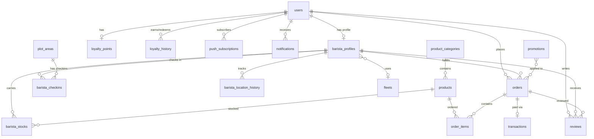

# KopiKeliling App — Implementation Plan

Aplikasi untuk mempertemukan penjual kopi keliling dengan customer, sekaligus memberikan rekomendasi keramaian & potensi penjualan.

---

## Tech Stack

| Layer | Technology | Rationale |
|---|---|---|
| **Framework** | Next.js 15 (App Router) | SSR, API Routes, RSC |
| **Language** | TypeScript | Type safety across stack |
| **Database** | PostgreSQL 16 + PostGIS | Geospatial queries (proximity, area containment) |
| **ORM** | Drizzle ORM | Lightweight, SQL-like, supports PostGIS via `geometry` + `customType` |
| **Auth** | Better Auth + Admin Plugin | Built-in RBAC with `createAccessControl`, session management |
| **Real-time** | Redis Pub/Sub + SSE | Location broadcasting, order notifications |
| **Maps** | Leaflet.js + React-Leaflet | Free, open-source, tile-based maps |
| **Payments** | QRIS via Midtrans/Xendit | Dynamic QR generation, callback-based payment confirmation |
| **Push Notifications** | Web Push API (VAPID) | Proximity alerts, order updates, weather warnings |
| **PWA** | next-pwa / Serwist | Offline support, installability |
| **Styling** | Tailwind CSS v4 + shadcn/ui | Rapid UI development, consistent design system |
| **State** | Zustand | Lightweight client state (location, cart, UI) |
| **Deployment** | VPS (Docker) or Vercel + Supabase | TBD based on budget |

---

## User Review Required

> [!IMPORTANT]
> **Payment Provider**: The brief mentions QRIS with a merchant ID. We need to decide between **Midtrans**, **Xendit**, or **DOKU** as the PSP. Each has different pricing, sandbox availability, and onboarding requirements. This choice affects the payment integration implementation.

> [!WARNING]
> **Real-time Architecture Cost**: Live GPS tracking for baristas requires persistent connections. On serverless platforms (Vercel), this needs a separate WebSocket/SSE service (e.g., a small VPS with Redis). This has infrastructure cost implications.

> [!IMPORTANT]
> **Privacy & Consent**: The brief correctly flags location privacy. We need to implement:
> - Explicit opt-in for location sharing (per-session for customers, per-shift for baristas)
> - Location data auto-expiry (delete after X hours)
> - Ability to "go invisible" for baristas during breaks

---

## Open Questions

1. **Deployment target**: VPS with Docker Compose (full control, cheaper for real-time) or Vercel + managed services (easier scaling, higher cost)?
2. **Payment provider preference**: Midtrans, Xendit, or DOKU? Do you already have a merchant account?
3. **Weather API**: Which service for weather warnings? OpenWeatherMap (free tier), BMKG API, or AccuWeather?
4. **Notification strategy**: Web Push only, or also integrate with WhatsApp/Telegram for critical alerts?
5. **Brand identity**: Do you have brand colors, logo, or design guidelines? Or should I design from scratch?
6. **Pre-order payment flow**: Should customers pay upfront (full payment), or just reserve and pay on pickup?
7. **Multi-brand support**: The brief mentions "suatu brand kopi keliling" — should the system support multiple coffee brands under one platform, or is this single-brand?
8. **Language**: Should the UI be in **Bahasa Indonesia** only, or bilingual (ID/EN)?

---

## Proposed Changes

### Phase 1: Foundation (Project Setup & Database)

#### [NEW] Project initialization
- `npx -y create-next-app@latest ./` with App Router, TypeScript, Tailwind CSS, ESLint
- Install: `drizzle-orm`, `drizzle-kit`, `postgres`, `better-auth`, `@better-auth/plugins`
- Install: `leaflet`, `react-leaflet`, `zustand`, `zod`, `redis` (ioredis)
- Configure `drizzle.config.ts`, `auth.ts`, `.env`

#### [NEW] Database Schema (`src/db/schema/`)

Below is the full schema design organized by domain:

---

**Auth & Users** — `src/db/schema/auth.ts`

```
users
├── id (uuid, PK)
├── name (text)
├── email (text, unique)
├── phone (text, unique)
├── emailVerified (boolean)
├── image (text, nullable)
├── role (enum: 'customer' | 'barista' | 'management')
├── isActive (boolean, default true)
├── createdAt / updatedAt (timestamp)
└── [Better Auth managed fields: sessions, accounts]
```

---

**Barista Domain** — `src/db/schema/barista.ts`

```
barista_profiles
├── id (uuid, PK)
├── userId (FK → users.id, unique)
├── employeeCode (text, unique)
├── status (enum: 'active' | 'on_break' | 'off_duty' | 'suspended')
├── currentLocation (geometry(Point, 4326), nullable) ← PostGIS
├── lastLocationUpdate (timestamp, nullable)
├── isVisible (boolean, default true) ← privacy toggle
├── assignedFleetId (FK → fleets.id, nullable)
└── createdAt / updatedAt

barista_checkins
├── id (uuid, PK)
├── baristaId (FK → barista_profiles.id)
├── plotAreaId (FK → plot_areas.id)
├── checkinTime (timestamp)
├── checkoutTime (timestamp, nullable)
├── location (geometry(Point, 4326))
└── notes (text, nullable)

barista_location_history
├── id (uuid, PK)
├── baristaId (FK → barista_profiles.id)
├── location (geometry(Point, 4326))
├── recordedAt (timestamp)
└── expiresAt (timestamp) ← auto-delete for privacy
```

---

**Fleet Management** — `src/db/schema/fleet.ts`

```
fleets
├── id (uuid, PK)
├── name (text) — e.g., "Gerobak A-01"
├── type (text) — e.g., "gerobak", "motor", "sepeda"
├── status (enum: 'ready' | 'in_use' | 'in_service' | 'retired')
├── notes (text, nullable)
└── createdAt / updatedAt
```

---

**Area & POI** — `src/db/schema/area.ts`

```
plot_areas
├── id (uuid, PK)
├── name (text)
├── description (text, nullable)
├── boundary (geometry(Polygon, 4326)) ← PostGIS polygon
├── isActive (boolean, default true)
└── createdAt / updatedAt

points_of_interest
├── id (uuid, PK)
├── name (text)
├── category (text) — e.g., "office_complex", "campus", "mall", "park"
├── location (geometry(Point, 4326))
├── crowdLevel (enum: 'low' | 'medium' | 'high') ← manual or computed
├── peakHours (jsonb, nullable) — e.g., {"weekday": ["07:00-09:00","12:00-13:00"], "weekend": ["10:00-14:00"]}
├── notes (text, nullable)
└── createdAt / updatedAt
```

---

**Products & Inventory** — `src/db/schema/product.ts`

```
product_categories
├── id (uuid, PK)
├── name (text)
├── sortOrder (integer)
└── createdAt / updatedAt

products
├── id (uuid, PK)
├── categoryId (FK → product_categories.id)
├── name (text)
├── description (text, nullable)
├── price (integer) ← stored in Rupiah (no decimals)
├── image (text, nullable)
├── isAvailable (boolean, default true)
└── createdAt / updatedAt

barista_stocks
├── id (uuid, PK)
├── baristaId (FK → barista_profiles.id)
├── productId (FK → products.id)
├── allocatedQty (integer) ← set by management
├── confirmedQty (integer, nullable) ← confirmed by barista
├── currentQty (integer) ← decremented on sale
├── shiftDate (date)
├── confirmedAt (timestamp, nullable)
└── createdAt / updatedAt
```

---

**Orders & Pre-orders** — `src/db/schema/order.ts`

```
orders
├── id (uuid, PK)
├── orderNumber (text, unique) — auto-generated
├── customerId (FK → users.id)
├── baristaId (FK → barista_profiles.id)
├── status (enum: 'pending' | 'confirmed' | 'preparing' | 'ready' | 'delivering' | 'completed' | 'cancelled')
├── type (enum: 'direct' | 'pre_order')
├── estimatedReadyAt (timestamp, nullable) ← for pre-orders
├── customerLocation (geometry(Point, 4326), nullable)
├── subtotal (integer)
├── discount (integer, default 0)
├── total (integer)
├── notes (text, nullable)
├── paidAt (timestamp, nullable)
└── createdAt / updatedAt

order_items
├── id (uuid, PK)
├── orderId (FK → orders.id)
├── productId (FK → products.id)
├── quantity (integer)
├── unitPrice (integer)
├── subtotal (integer)
└── notes (text, nullable)
```

---

**Payments** — `src/db/schema/payment.ts`

```
payment_settings
├── id (uuid, PK)
├── qrisMerchantId (text)
├── qrisApiKey (text, encrypted)
├── paymentProvider (enum: 'midtrans' | 'xendit' | 'doku')
├── isProduction (boolean, default false)
└── updatedAt

transactions
├── id (uuid, PK)
├── orderId (FK → orders.id)
├── externalTxId (text, nullable) ← from payment gateway
├── method (enum: 'qris' | 'cash')
├── amount (integer)
├── status (enum: 'pending' | 'paid' | 'failed' | 'refunded')
├── qrCodeUrl (text, nullable)
├── paidAt (timestamp, nullable)
├── callbackPayload (jsonb, nullable)
└── createdAt / updatedAt
```

---

**Loyalty & Promotions** — `src/db/schema/loyalty.ts`

```
loyalty_points
├── id (uuid, PK)
├── customerId (FK → users.id)
├── points (integer, default 0)
└── updatedAt

loyalty_history
├── id (uuid, PK)
├── customerId (FK → users.id)
├── orderId (FK → orders.id, nullable)
├── type (enum: 'earned' | 'redeemed' | 'expired' | 'adjustment')
├── amount (integer)
├── description (text)
└── createdAt

promotions
├── id (uuid, PK)
├── name (text)
├── description (text, nullable)
├── type (enum: 'percentage' | 'flat' | 'loyalty_multiplier')
├── value (integer) ← percentage or flat amount
├── minOrderAmount (integer, nullable)
├── startDate (timestamp)
├── endDate (timestamp)
├── isActive (boolean, default true)
├── maxUsageCount (integer, nullable)
├── currentUsageCount (integer, default 0)
└── createdAt / updatedAt
```

---

**Reviews** — `src/db/schema/review.ts`

```
reviews
├── id (uuid, PK)
├── customerId (FK → users.id)
├── baristaId (FK → barista_profiles.id)
├── orderId (FK → orders.id, nullable)
├── rating (integer, 1-5)
├── comment (text, nullable)
└── createdAt
```

---

**Notifications** — `src/db/schema/notification.ts`

```
push_subscriptions
├── id (uuid, PK)
├── userId (FK → users.id)
├── endpoint (text)
├── keys (jsonb) ← { p256dh, auth }
├── isActive (boolean, default true)
└── createdAt

notifications
├── id (uuid, PK)
├── userId (FK → users.id)
├── type (enum: 'proximity' | 'order_update' | 'promo' | 'weather' | 'system')
├── title (text)
├── body (text)
├── data (jsonb, nullable)
├── isRead (boolean, default false)
└── createdAt
```

---

### Phase 2: Auth & RBAC

#### [NEW] `src/lib/auth.ts` — Better Auth configuration
- Configure Better Auth with PostgreSQL adapter
- Admin plugin with 3 roles: `customer`, `barista`, `management`
- Access control statements for each resource (orders, products, baristas, fleet, etc.)

#### [NEW] `src/lib/permissions.ts` — RBAC definitions
```
Resources & Permissions:
├── barista:    [view, create, update, delete, track]
├── order:     [create, view, update, cancel, manage]
├── product:   [view, create, update, delete]
├── fleet:     [view, create, update, delete]
├── stock:     [view, allocate, confirm, update]
├── promotion: [view, create, update, delete]
├── report:    [view, export]
├── settings:  [view, edit]

Role Mapping:
├── customer:    order[create,view,cancel], product[view], barista[view]
├── barista:     order[view,update], stock[view,confirm,update], barista[view,track]
└── management:  ALL permissions
```

#### [NEW] `src/middleware.ts` — Route protection
- Redirect unauthenticated users to `/login`
- Role-based route gating: `/dashboard/management/*`, `/dashboard/barista/*`, `/dashboard/customer/*`

#### [NEW] Auth pages
- `src/app/(auth)/login/page.tsx`
- `src/app/(auth)/register/page.tsx`
- `src/app/(auth)/forgot-password/page.tsx`

---

### Phase 3: Core Features — Management Dashboard

#### [NEW] `src/app/dashboard/management/` — Management views

| Page | Description |
|---|---|
| `/overview` | KPI cards, daily sales chart, active baristas count, fleet status |
| `/baristas` | List, CRUD, status management, assignment |
| `/baristas/live-map` | Real-time Leaflet map with barista markers (SSE-powered) |
| `/fleet` | Fleet CRUD, status toggles |
| `/products` | Product & category CRUD with image upload |
| `/stocks` | Allocate daily stock per barista, view live stock levels |
| `/orders` | All orders list with filters and status tracking |
| `/poi` | POI management, crowd level editor, map-based CRUD |
| `/areas` | Plot area drawing on map (Leaflet Draw), assignment |
| `/promotions` | Promo CRUD, activation toggle |
| `/reports` | Sales recap with filters (day/week/month/year), charts (Recharts) |
| `/payments` | QRIS settings, transaction history |
| `/settings` | App settings, notification preferences |

---

### Phase 4: Core Features — Barista Dashboard

#### [NEW] `src/app/dashboard/barista/` — Barista views

| Page | Description |
|---|---|
| `/home` | Today's assignment, stock confirmation, quick actions |
| `/stocks` | View & confirm allocated stock, update current quantities |
| `/map` | See other baristas, POI, recommended areas, check-in button |
| `/orders` | Incoming orders, status updates, delivery info |
| `/customers` | Customer list (from orders), preferences |
| `/checkin` | Check-in/out at assigned plot areas |

---

### Phase 5: Core Features — Customer App

#### [NEW] `src/app/dashboard/customer/` — Customer views

| Page | Description |
|---|---|
| `/home` | Nearby baristas map, search, featured promos |
| `/barista/[id]` | Barista profile, menu, rating, schedule/route history |
| `/order/new` | Menu selection, cart, pre-order time picker |
| `/order/[id]` | Order tracking, delivery ETA |
| `/orders` | Order history |
| `/loyalty` | Points balance, history, redemption |
| `/notifications` | Notification center |
| `/settings` | Profile, location preferences, push notification toggle |

---

### Phase 6: Real-time & Integrations

#### [NEW] Real-time location system
- **Barista → Server**: Barista app sends GPS coordinates via `POST /api/location/update` every 5 seconds (throttled)
- **Server → Redis**: Publishes to `channel:barista:{id}` via Redis Pub/Sub
- **Server → Client**: SSE endpoint `GET /api/location/stream?baristaIds=...` streams location updates
- **Proximity detection**: Background job checks customer locations against barista locations, triggers push notification if within configurable radius (default: 500m)

#### [NEW] QRIS payment flow
1. Customer places order → Server creates transaction → Calls PSP API to generate dynamic QRIS
2. QRIS code displayed to customer
3. Customer scans & pays via any e-wallet/bank app
4. PSP sends callback → Server verifies signature → Updates transaction status
5. Order status moves to `confirmed`

#### [NEW] Push notifications
- Web Push API with VAPID keys
- Service worker handles background notifications
- Notification types: proximity alert, order update, promo, weather warning

#### [NEW] PWA configuration
- Service worker for offline support
- App manifest with icons, splash screens
- Caching strategy: NetworkFirst for API, CacheFirst for static assets

---

## Database Diagram



---

## Verification Plan

### Automated Tests
- **Schema**: `drizzle-kit push` succeeds against PostgreSQL + PostGIS
- **Auth**: Registration, login, role assignment, permission checks
- **API**: CRUD operations for all resources with role-based access validation
- **Geospatial**: PostGIS queries for proximity, area containment, distance calculations
- **Payment**: Sandbox integration tests with chosen PSP

### Manual Verification
- **PWA**: Install on mobile, verify offline behavior
- **Real-time**: Open 2 browser windows — management sees barista location update live
- **Pre-order flow**: Full customer journey from browse → order → pay → pickup
- **Responsive**: Test on mobile viewport sizes (375px, 390px, 414px)

---

## Development Phases & Timeline Estimate

| Phase | Focus | Est. Duration |
|---|---|---|
| **Phase 1** | Project setup, DB schema, migrations, PostGIS | 1-2 days |
| **Phase 2** | Auth, RBAC, middleware, login/register pages | 1-2 days |
| **Phase 3** | Management dashboard (all views) | 4-5 days |
| **Phase 4** | Barista dashboard | 2-3 days |
| **Phase 5** | Customer app | 3-4 days |
| **Phase 6** | Real-time, payments, push notifications, PWA | 3-4 days |
| **Polish** | Testing, responsive, performance, edge cases | 2-3 days |
| **Total** | | **~16-23 days** |

> [!NOTE]
> Timeline assumes focused development sessions. Phases can be parallelized where dependencies allow.
